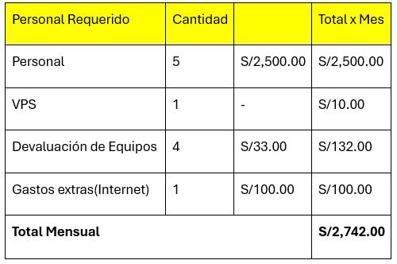
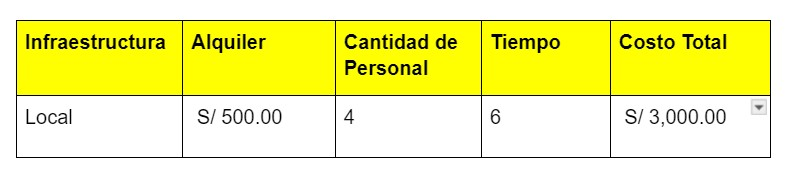
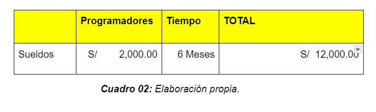
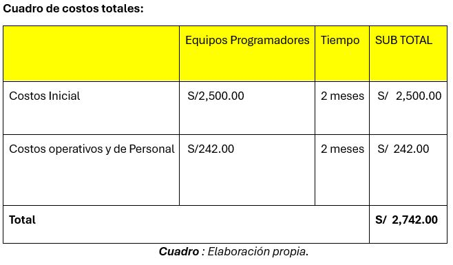
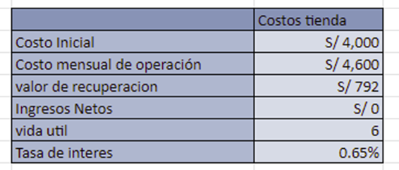
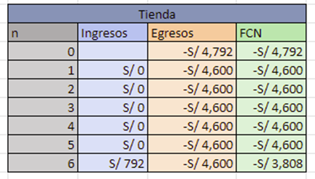
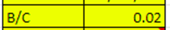

**UNIVERSIDAD PRIVADA DE TACNA**  
**FACULTAD DE INGENIERIA**  
**Escuela Profesional de Ingeniería de Sistemas**  

**Proyecto: *Proyecto Prevalencia de Enfermedades en el Campus***  

Curso: *Inteligencia de Negocios*  
Docente: Patrick Cuadros Quiroga  

**Integrantes:**  
***Meza Noalcca Jean Marco (2021071087)***  
***Luna Juárez Juan Brendon (2020068762)***  
***Elvis Mamani Valdivia (2020068763)***  
***Cristian Quispe Levano (2018000590)***  
***Angel Hernandez Cruz (2021000000)***  

**Tacna – Perú**  
**2024**

---

## Sistema de Evaluación de la Incidencia de Enfermedades en el Entorno Estudiantil

### Informe de Factibilidad

**Versión: *1.0***

| CONTROL DE VERSIONES  |     |     |     |     |
|:---------------------:|:---:|:---:|:---:|:---:|
| Versión              | Hecha por | Revisada por | Aprobada por | Fecha | Motivo |
| 1.0                  | JBL    | ELV          | JMM        | 10/08/2024 | Versión Original |
| 1.1                  | CLQ    | ELV          | JMM        | 25/08/2020 | Versión Original |
| 1.2                  | EMV    | JMM          | JBL        | 10/09/2020 | Versión Original |
| 1.3                  | JMM    | EMV          | CLQ        | 21/09/2020 | Versión Original |

---

# Índice General

1. [Descripción del Proyecto](#descripcion-del-proyecto)
   - [1.1 Nombre del Proyecto](#nombre-del-proyecto)
   - [1.2 Duración del Proyecto](#duracion-del-proyecto)
   - [1.3 Descripción](#descripcion)
   - [1.4 Objetivos](#objetivos)
2. [Riesgos](#riesgos)
3. [Análisis de la Situación Actual](#analisis-de-la-situacion-actual)
   - [3.1 Planteamiento del Problema](#planteamiento-del-problema)
   - [3.2 Consideraciones de Hardware y Software](#consideraciones-de-hardware-y-software)
4. [Estudio de Factibilidad](#estudio-de-factibilidad)
   - [4.1 Factibilidad Técnica](#factibilidad-tecnica)
   - [4.2 Factibilidad Económica](#factibilidad-economica)
   - [4.3 Factibilidad Operativa](#factibilidad-operativa)
   - [4.4 Factibilidad Legal](#factibilidad-legal)
   - [4.5 Factibilidad Social](#factibilidad-social)
   - [4.6 Factibilidad Ambiental](#factibilidad-ambiental)
5. [Análisis Financiero](#analisis-financiero)
6. [Conclusiones](#conclusiones)

---

## Informe de Factibilidad

### 1. Descripción del Proyecto

#### 1.1 Nombre del Proyecto
**Proyecto Prevalencia de Enfermedades en el Campus**

#### 1.2 Duración del Proyecto
La duración del proyecto está planificada para 3 meses.

#### 1.3 Descripción
Este proyecto tiene como objetivo investigar cómo las enfermedades y dolencias han afectado a la salud y el bienestar general de los estudiantes universitarios en la Universidad Privada de Tacna. En el contexto universitario, donde los estudiantes enfrentan un entorno académico y social intensivo, es crucial entender cómo la prevalencia de estas enfermedades puede impactar su calidad de vida y rendimiento académico. 

El estudio analizará la relación entre la incidencia de dolencias y diversos factores, como la densidad en espacios comunes, la efectividad de las políticas de salud existentes ademas de tomar sus precauciones antes de iniciar cada semestre academico donde se analiza las dolencias comunes en cada semestre académico para hace sus prevenciones. La importancia radica en proporcionar datos basados en evidencia para desarrollar estrategias de prevención y mejorar la salud pública en el campus.

#### 1.4 Objetivos

**Objetivo General**  
Evaluar la salud y el acceso a los servicios de la Universidad Privada de Tacna, a través del análisis de la asistencia a tópicos, así como de indicadores de dolencias segun semestre academico, considerando variables como el género y la matriculación en diferentes semestres durante los años 2018, 2019, 2022 y 2023.

**Objetivos Específicos**  
- *Cantidad de estudiantes que asistieron a tópicos por facultades en los años 2018, 2019, 2022 y 2023.
- *Calcular el promedio de dolencias entre publico masculino o femenino.
- *Calcular el promedio de dolencias previo inicio del semestre para evitar que continúen.
- *Analizar de tendencias de Salud Fisica de los Estudiantes de la Upt.
- *Evaluar el numero de enfermedades que son detectadas en un Año.
- *Determinar el promedio de estudiantes matriculados en el segundo semestre de los años 2018, 2019, 2022 y 2023.
- *Calcular el promedio de estudiantes matriculados por facultad en el primer semestre de los años 2018, 2019, 2022 y 2023.

---

### 2. Riesgos
- **Baja tasa de participación**: Es posible que no todos los estudiantes participen en el estudio, lo que puede afectar la representatividad de los resultados.  
- **Mitigación**: Promover el estudio a través de campañas de comunicación y ofrecer incentivos para aumentar la participación.

- **Recopilación inexacta de datos**: La calidad de los datos puede verse afectada por errores en la recolección o la autoevaluación de los participantes.  
- **Mitigación**: Utilizar métodos de recolección validados y realizar pruebas preliminares para asegurar la precisión y confiabilidad de los datos.

- **Factores externos que afectan la salud mental**: Eventos externos o cambios en el entorno pueden influir en los resultados del estudio.  
- **Mitigación**: Controlar y registrar estos factores en el análisis para ajustar los resultados en consecuencia.

- **Problemas éticos y de privacidad**: Asegurar la confidencialidad y el consentimiento informado de los participantes es crucial.  
- **Mitigación**: Implementar protocolos rigurosos para proteger la privacidad de los participantes y cumplir con las normas éticas.

- **Limitaciones de recursos**: El financiamiento o los recursos disponibles podrían ser insuficientes para llevar a cabo el proyecto de manera óptima.  
- **Mitigación**: Buscar financiamiento adicional, colaboraciones con otras instituciones o ajustes en el alcance del proyecto para adaptarse a los recursos disponibles.

---

### 3. Análisis de la Situación Actual

#### 3.1 Planteamiento del Problema
La Universidad Privada de Tacna (UPT) enfrenta un creciente interés en mejorar la salud  y el bienestar de sus estudiantes. Se han implementado diversos programas de apoyo psicológico y bienestar, pero aún no se ha evaluado exhaustivamente el impacto en la salud mental de los estudiantes.

#### 3.2 Consideraciones de Hardware y Software

**Hardware:**
- **Computadoras o Laptops**:
  
| Especificación            | Requerimiento                      |
|---------------------------|------------------------------------|
| Procesador                | Intel Core i5 o superior           |
| Memoria RAM               | Mínimo de 8 GB                     |
| Almacenamiento            | SSD de al menos 256 GB            |
| Pantalla                  | Resolución Full HD (1920x1080 píxeles) |

**Software:**
- **Power BI Desktop**: 
  - Aplicación gratuita que permite el diseño, modelado y análisis de informes de datos. Compatible con Windows 10 o superior.

---

### 4. Estudio de Factibilidad
El estudio de factibilidad tiene como objetivo determinar si el análisis de la prevalencia de enfermedades comunes entre estudiantes es viable en términos de recursos técnicos, económicos y organizativos.

#### 4.1 Factibilidad Técnica
- **Hardware**:
  - Equipos de computación adecuados en el campus.
  - Servidores con capacidad suficiente para manejar grandes volúmenes de datos.

- **Software**:
  - Aplicaciones como SPSS o Power BI.
  - Infraestructura de red sólida para acceder a bases de datos y sistemas de análisis.

**Conclusión Técnica**: La tecnología actual en el campus es adecuada para realizar el análisis de la prevalencia de enfermedades.

#### 4.2 Factibilidad Económica

**Costos del Proyecto:**
| Concepto                    | Costo Estimado                   |
|-----------------------------|----------------------------------|
| Personal                    | $4,000.00                        |
| Equipos y Software          | $2,000 - $5,000                 |
| Materiales y Otros Recursos  | $1,000 - $2,000                 |

**Beneficios Esperados:**
- **Mejora en la Salud Estudiantil**: Identificación de tendencias que permitirá implementar intervenciones preventivas.
- **Datos para Políticas**: Apoyará la toma de decisiones para mejorar las políticas de salud en el campus.
- **Reconocimiento y Financiamiento**: Un estudio exitoso puede atraer financiamiento adicional.

**Conclusión Económica**: La inversión inicial está justificada por los beneficios esperados. El costo total del proyecto se estima entre **$13,000** y **$22,000**.

##### 4.2.1 Costos Generales

| Concepto                  | Monto         |
|---------------------------|---------------|
| Sueldo promedio           | S/ 2,800     |
| PAGO INICIAL              | S/ 1,941.82  |
| PAGO MENSUAL              | S/ 1,941.82  |
| VALOR DE SALVAMENTO       | S/ 792.00    |
| TIEMPO ESTIMADO           | 6 meses      |
| TASA DE INTERÉS           | 7.8%         |

---

##### 4.2.2 Costos Operativos durante el Desarrollo
Costos asociados con sueldos de programadores y diseñadores durante los 6 meses.

---

##### 4.2.3 Costos del Ambiente
Costos relacionados con el entorno de un centro de desarrollo de software

---

##### 4.2.4 Costos de Personal
- Sueldo de un programador en 2024: **S/.9.00 por hora**.

---

##### 4.2.5 Costos Totales del Desarrollo del Sistema
Resumen de costos iniciales, operativos y de personal.

---

#### 4.3 Factibilidad Operativa
El proyecto tiene como objetivo mejorar la gestión de la información clínica y administrativa del policlínico.

#### 4.4 Factibilidad Legal
- **Cumplimiento de Normativas**: Asegurarse de que el sistema cumple con las leyes de protección de datos y regulaciones del sector salud.

#### 4.5 Factibilidad Social
- **Clima Político**: Verificar que no existan nuevas regulaciones que afecten el uso de tecnologías de datos.

#### 4.6 Factibilidad Ambiental
- **Impacto Directo**: El sistema tiene un impacto ambiental mínimo. Se recomienda el uso de fuentes de energía renovable.

---

### 5. Análisis Financiero
El análisis se ocupa de los ingresos y gastos asociados al proyecto.

#### 5.1 Justificación de la Inversión

##### 5.1.1 Beneficios del Proyecto
- Mejora en la eficiencia del área bajo estudio.
- Cumplimiento de requerimientos gubernamentales.
- Toma acertada de decisiones.

##### 5.1.2 Criterios de Inversión
**Costos Totales del Proyecto:**

**Flujo de Caja Neto durante el tiempo del Proyecto:**

###### 5.1.2.1 Relación Beneficio/Costo (B/C)
El beneficio al ser 0.02 no aporta ningún beneficio inmediato, pero ayudará a prevenir futuras crisis.

###### 5.1.2.2 Valor Actual Neto (VAN)
Gasto del Proyecto llevado a la actualidad.

###### 5.1.2.3 Tasa Interna de Retorno (TIR)
No existe TIR.

---

### 6. Conclusiones
Los resultados del análisis de factibilidad indican que el proyecto es viable y factible.

---

**Referencias**  
