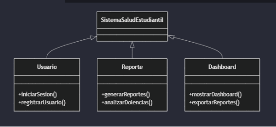
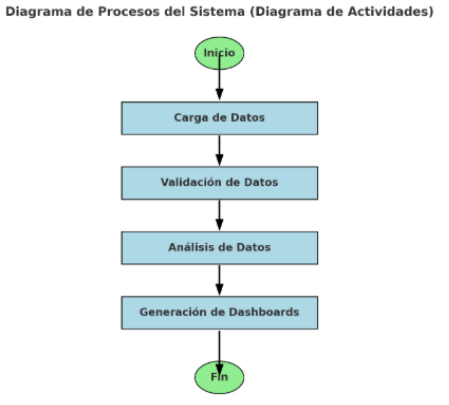
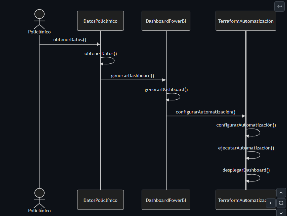
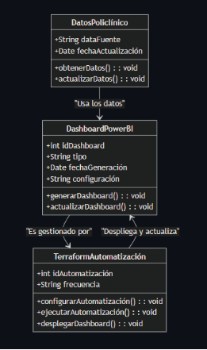

Logo de Mi Empresa		Logo de mi Cliente

**UNIVERSIDAD PRIVADA DE TACNA**

**FACULTAD DE INGENIERÍA**

**Escuela Profesional de Ingeniería de Sistemas**

**Proyecto Prevalencia de Enfermedades en el Campus**

Curso: *Inteligencia de Negocios*

Docente: *Patrick Cuadros Quiroga*

Integrantes:

***Luna Juárez Juan Brendon		(2020068762)***

***Elvis Mamani Valdivia		(2020068763)***

***Jean Marco Meza Noalcca		(2021071087)***

***Cristian Quispe Levano 		(2018000590)***

***Angel Hernandez Cruz		(2021070017)***

**Tacna – Perú**

***2024***

|CONTROL DE VERSIONES||||||
| :-: | :- | :- | :- | :- | :- |
|Versión|Hecha por|Revisada por|Aprobada por|Fecha|Motivo|
|1\.0|MPV|ELV|ARV|10/10/2020|Versión Original|

Sistema *{Nombre del Sistema}*

Documento de Especificación de Requerimientos de Software

Versión *{1.0}*

|CONTROL DE VERSIONES||||||
| :-: | :- | :- | :- | :- | :- |
|Versión|Hecha por|Revisada por|Aprobada por|Fecha|Motivo|
|1\.0|MPV|ELV|ARV|10/10/2020|Versión Original|

**INDICE GENERAL**

[INTRODUCCION	](#_heading=h.30j0zll)4

[I. Generalidades de la Empresa	](#_heading=h.1fob9te)5

`	`1. Nombre de la Empresa	5

`	`2. Vision	5

`	`3. Mision	5

`	`4. Organigrama	5

[II. Visionamiento de la Empresa	](#_heading=h.1fob9te)5

`	`1. Descripcion del Problema	5

`	`2. Objetivos de Negocios	5

`	`3. Objetivos de Diseño	5

`	`4. Alcance del proyecto	5

`	`5. Viabilidad del Sistema	5

`	`6. Informacion obtenida del Levantamiento de Informacion	6

[III.  Análisis de Procesos	](#_heading=h.1fob9te)6

`	`a) Diagrama del Proceso Actual – Diagrama de actividades	6

`	`b) Diagrama del Proceso Propuesto – Diagrama de actividades Inicial	7

[IV Especificacion de Requerimientos de Software	](#_heading=h.1fob9te)7

`	`a) Cuadro de Requerimientos funcionales Inicial	7

`	`b) Cuadro de Requerimientos No funcionales	7

`	`c) Cuadro de Requerimientos funcionales Final	8

`	`d) Reglas de Negocio	9

[V Fase de Desarrollo	](#_heading=h.1fob9te)12

`	`1. Perfiles de Usuario	12

`	`2. Modelo Conceptual	5

`	`a) Diagrama de Paquetes	5

`	`b) Diagrama de Casos de Uso	12

`	`c) Escenarios de Caso de Uso (narrativa)	14

[    3. Modelo Logico	](#_heading=h.1fob9te)23

`	`a) Analisis de Objetos	23

`	`b) Diagrama de Actividades con objetos	32

	c) Diagrama de Secuencia	37

`	`d) Diagrama de Clases	42

[CONCLUSIONES	](#_heading=h.2et92p0)46

[RECOMENDACIONES	](#_heading=h.tyjcwt)46

[BIBLIOGRAFIA	](#_heading=h.3dy6vkm)46

[WEBGRAFIA	](#_heading=h.1t3h5sf)46

### **INTRODUCCIÓN**
Este documento presenta la especificación de requerimientos para el desarrollo del sistema de evaluación de la incidencia de enfermedades en el entorno estudiantil. Se detalla desde los aspectos generales de la empresa hasta los procesos actuales y propuestos, especificación de requerimientos funcionales y no funcionales, y el diseño conceptual y lógico del sistema.

### **I. Generalidades de la Empresa**
#### **1. Nombre de la Empresa**
Universidad Privada de Tacna
#### **2. Visión**
Ser una institución educativa líder en innovación y salud estudiantil, promoviendo un entorno saludable y sostenible para la comunidad universitaria.
#### **3. Misión**
Brindar servicios educativos y de salud integrales que impacten positivamente en el bienestar físico y mental de nuestros estudiantes.
#### **4. Organigrama**
- Rectoría
- Facultad de Ingeniería
- Departamento de Bienestar Estudiantil
- Unidad de Análisis de Datos de Salud
### **II. Visionamiento de la Empresa**
#### **1. Descripción del Problema**
La prevalencia de enfermedades y dolencias entre los estudiantes afecta su rendimiento académico y calidad de vida. Actualmente, no existe un sistema que facilite el análisis y la prevención de estas condiciones.
#### **2. Objetivos de Negocios**
- Mejorar la gestión de información sobre salud estudiantil.
- Implementar estrategias preventivas basadas en datos históricos y tendencias.
#### **3. Objetivos de Diseño**
- Crear un sistema intuitivo para el análisis de datos de salud.
- Diseñar dashboards interactivos para la toma de decisiones informadas.
#### **4. Alcance del Proyecto**
El sistema abarcará los datos de salud estudiantil entre los años 2018 y 2023, con enfoque en dolencias comunes, tendencias por género y semestre académico.
#### **5. Viabilidad del Sistema**
El sistema es viable técnica, económica y operativamente, utilizando tecnologías existentes en la institución.
#### **6. Información Obtenida del Levantamiento de Información**
Se recopilaron datos de asistencia a tópicos, dolencias reportadas, y estadísticas de matrícula para análisis detallados.
### **III. Análisis de Procesos**
#### **a) Diagrama del Proceso Actual – Diagrama de Actividades**
1. Recopilación manual de datos de salud estudiantil.
1. Análisis básico en hojas de cálculo.
1. Presentación de informes semestrales sin profundización en tendencias.
#### **b) Diagrama del Proceso Propuesto – Diagrama de Actividades Inicial**
1. Registro automatizado de datos en el sistema.
1. Análisis automatizado de tendencias y dolencias comunes.
1. Generación de reportes dinámicos y dashboards interactivos.
### **IV. Especificación de Requerimientos de Software**
#### a) Cuadro de Requerimientos Funcionales Inicial

|Funcionalidad|Descripción|
| :- | :- |
|Análisis comparativo|Comparación entre dolencias reportadas en diferentes años o grupos.|
|Visualización de estadísticas|Representación de tendencias por género, semestre y dolencias comunes.|
|Dashboard interactivo|Visualización de datos de salud estudiantil mediante gráficos dinámicos.|
|Identificación de dolencias|Reconocimiento de patrones en dolencias comunes previas al inicio del semestre.|
|Control por ciclo|Monitoreo de intervenciones preventivas por ciclo académico.|

b) Cuadro de Requerimientos No Funcionales

|Funcionalidad|Descripción|
| :- | :- |
|Seguridad y Privacidad|Protección de datos personales según normativa local y acceso restringido a usuarios autorizados.|
|Usabilidad|Interfaz intuitiva y accesible desde dispositivos móviles y de escritorio.|
|Escalabilidad|Manejo de mayores volúmenes de datos con adaptabilidad a nuevas fuentes de información.|
|Rendimiento|Generación de reportes en tiempo real o en tiempos aceptables (segundos o minutos)|
|Compatibilidad|Integración con herramientas como Power BI y compatibilidad con bases de datos existentes.|

#### **c) Cuadro de Requerimientos Funcionales Final**

#### **d) Reglas de Negocio**
1. Los datos sensibles deben ser accesibles únicamente por personal autorizado.
1. Los reportes deben ser generados cada semestre académico.
1. Las alertas preventivas se disparan si una dolencia supera el umbral definido en el sistema.

### **V. Fase de Desarrollo**
#### **1. Perfiles de Usuario**
- **Administrador:** Gestiona el sistema y tiene acceso total a los datos.
- **Estudiante:** Consulta información general y recibe alertas preventivas.
#### **2. Modelo Conceptual**
##### **a) Diagrama de Paquetes**

##### **b) Diagrama de Casos de Uso**

##### **c) Escenarios de Caso de Uso (Narrativa)**
### 1. Análisis Comparativo
Descripción:
Este requisito permite realizar una comparación entre las dolencias reportadas en diferentes años o grupos. El sistema proporcionará herramientas que faciliten identificar similitudes y diferencias en los datos de salud estudiantil de acuerdo con períodos académicos, géneros o grupos de interés.
Funcionalidad:

- Comparar dolencias por género (masculino vs. femenino).
- Analizar variaciones entre años académicos (2018, 2019, 2022, 2023).
- Identificar cambios en las dolencias según semestres académicos.

Beneficio:
Proporciona una visión clara de las tendencias históricas para la toma de decisiones informadas en salud pública del campus.

-----
### 2. Visualización de Estadísticas
Descripción:
Este requisito se centra en representar las estadísticas de salud estudiantil a través de gráficos y tablas. Las tendencias serán categorizadas por género, semestre y las dolencias más comunes reportadas en el campus.
Funcionalidad:

- Creación de gráficos de barras y líneas para identificar las tendencias en la prevalencia de dolencias.
- Categorización de datos por género (femenino, masculino) y semestre (primer y segundo semestre).
- Mostrar estadísticas específicas de dolencias comunes antes y durante cada período académico.

Beneficio:
Ayuda a visualizar de forma sencilla y rápida el impacto de las dolencias en diferentes contextos para facilitar el análisis.

-----
### 3. Dashboard Interactivo
Descripción:
Este requisito provee un espacio interactivo donde los usuarios pueden explorar datos relacionados con la salud estudiantil mediante gráficos dinámicos y personalizables.
Funcionalidad:

- Mostrar indicadores clave de salud (número de estudiantes afectados, dolencias más frecuentes).
- Permitir a los usuarios filtrar los datos según género, semestre o tipo de dolencia.
- Interactividad con gráficos dinámicos para explorar estadísticas a profundidad.

Beneficio:
Ofrece una plataforma intuitiva que facilita la interacción con los datos y promueve un análisis más efectivo.

-----
### 4. Identificación de Dolencias
Descripción:
Este requisito permite reconocer patrones en las dolencias comunes reportadas antes del inicio de cada semestre académico. El sistema analizará datos históricos para anticipar problemas de salud recurrentes.
Funcionalidad:

- Analizar reportes previos de dolencias para identificar patrones recurrentes.
- Generar alertas para las dolencias más comunes antes del inicio del semestre.
- Establecer relaciones entre factores externos y el incremento de ciertas dolencias.

Beneficio:
Facilita la implementación de medidas preventivas antes del inicio del ciclo académico, reduciendo la incidencia de problemas de salud.

-----
### 5. Control por Ciclo
Descripción:
Este requisito se enfoca en monitorear las intervenciones preventivas realizadas durante cada ciclo académico. El sistema registrará y analizará las acciones implementadas para medir su efectividad.
Funcionalidad:

- Registrar las intervenciones preventivas implementadas por semestre.
- Evaluar el impacto de dichas intervenciones en la salud estudiantil.
- Generar reportes para identificar áreas de mejora en futuras intervenciones.

Beneficio:
Garantiza un seguimiento eficiente de las estrategias preventivas y contribuye a optimizar las políticas de salud en el campus.

#### **3. Modelo Lógico**
##### **a) Análisis de Objetos**
Objetos principales: Reportes, Dolencias, Intervenciones, Usuarios.
##### **b) Diagrama de Actividades con Objetos**
	

##### **c) Diagrama de Secuencia**

##### **d) Diagrama de Clases**

### **Conclusiones**
1. El sistema diseñado para la evaluación de la prevalencia de enfermedades en el campus universitario es **viable técnica, económica y operativamente**. Este permitirá a las autoridades tomar decisiones informadas basadas en datos concretos.
1. La integración de herramientas como **dashboards interactivos y análisis de datos automatizados** mejorará significativamente la eficiencia en la gestión de información de salud estudiantil.
1. La implementación de medidas preventivas basadas en tendencias identificadas ayudará a **reducir la incidencia de enfermedades comunes**, promoviendo un entorno más saludable para los estudiantes.
1. El enfoque centrado en la protección de datos asegura que se cumpla con las normativas locales, protegiendo la privacidad de los usuarios.
   -----
   ### **Recomendaciones**
1. **Capacitación continua**: Es esencial entrenar al personal administrativo y técnico en el uso del sistema y sus herramientas para maximizar los beneficios del mismo.
1. **Actualización periódica de datos**: Los datos deben actualizarse regularmente para mantener la precisión de los análisis y reportes generados.
1. **Ampliación del sistema**: Explorar la posibilidad de incluir módulos adicionales para el seguimiento de la salud mental, vacunaciones u otras métricas relevantes de salud estudiantil.
1. **Pruebas regulares**: Realizar pruebas periódicas de seguridad y rendimiento para garantizar el correcto funcionamiento del sistema y la protección de los datos.
1. **Estrategias preventivas**: Basarse en los patrones identificados para establecer medidas preventivas específicas en los ciclos académicos.
   -----
   ### **Bibliografía**
1. Pressman, R. S. (2014). *Ingeniería de software: Un enfoque práctico*. McGraw Hill.
1. Sommerville, I. (2015). *Software Engineering*. Pearson Education.
1. Fowler, M. (2004). *UML Distilled: A Brief Guide to the Standard Object Modeling Language*. Addison-Wesley.
   -----
   ### **Webgrafía**
1. Universidad Privada de Tacna. *(2024).* Recuperado de[upt.edu.pe](https://www.upt.edu.pe)
1. Microsoft Power BI Documentation. *(2024).* Recuperado de[docs.microsoft.com/powerbi](https://docs.microsoft.com/powerbi)
1. PlantUML. *(2024).* Recuperado de[plantuml.com](https://plantuml.com)
1. Terraform Documentation. *(2024).* Recuperado de terraform.io

