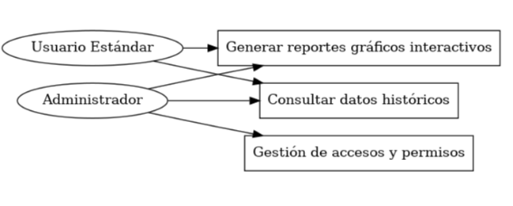
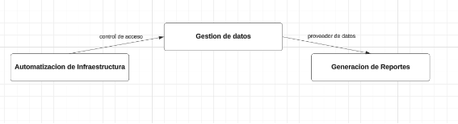
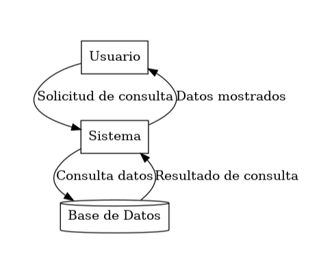
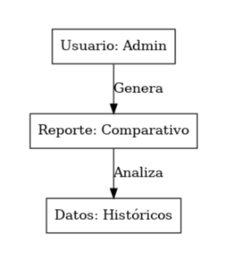
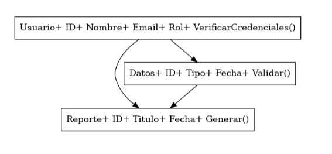
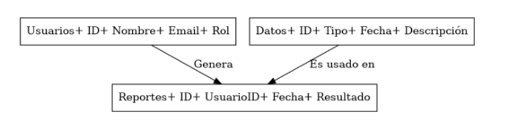
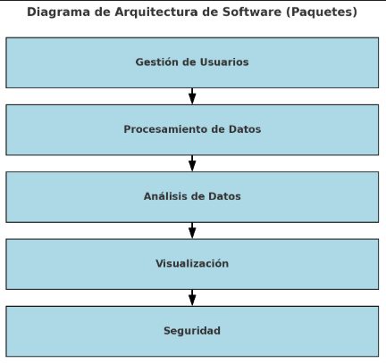
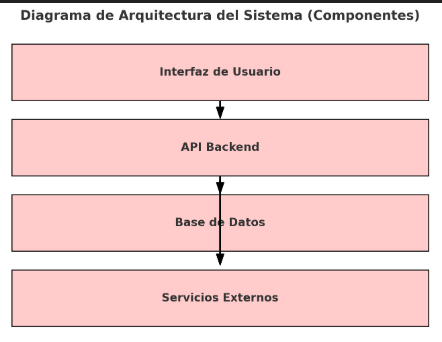
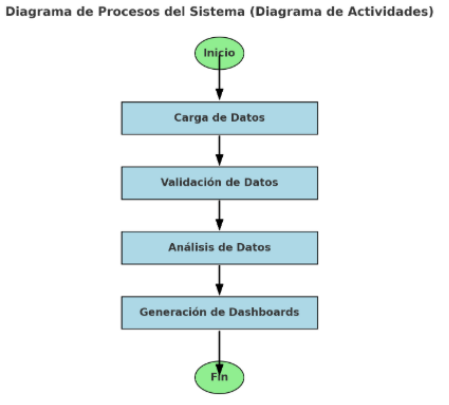

Logo de Mi Empresa		Logo de mi Cliente

**UNIVERSIDAD PRIVADA DE TACNA**

**FACULTAD DE INGENIERÍA**

**Escuela Profesional de Ingeniería de Sistemas**

**Proyecto Prevalencia de Enfermedades en el Campus**

Curso: *Inteligencia de Negocios*

Docente: *Patrick Cuadros Quiroga*

Integrantes:

***Luna Juárez Juan Brendon		(2020068762)***

***Elvis Mamani Valdivia		(2020068763)***

***Jean Marco Meza Noalcca		(2021071087)***

***Cristian Quispe Levano 		(2018000590)***

***Angel Hernandez Cruz		(2021070017)***

**Tacna – Perú**

***2024***

|CONTROL DE VERSIONES||||||
| :-: | :- | :- | :- | :- | :- |
|Versión|Hecha por|Revisada por|Aprobada por|Fecha|Motivo|
|1\.0|MPV|ELV|ARV|10/10/2020|Versión Original|

Sistema *Prevalencia de enfermedades en el campus*

Documento de Arquitectura de Software

Versión *1.2*

|CONTROL DE VERSIONES||||||
| :-: | :- | :- | :- | :- | :- |
|Versión|Hecha por|Revisada por|Aprobada por|Fecha|Motivo|
|1\.0|MPV|ELV|ARV|10/10/2024|Versión Original|
|1\.1||||15/11/2024|Revisión del diseño|
|1\.2||||18/11/2024|Correlación final |

INDICE GENERAL

[***1.***](#_heading=h.1fob9te)***INTRODUCCIÓN	5******

[**1.1.**](#_heading=h.3znysh7)**Propósito (Diagrama 4+1)	5**

[**1.2.**](#_heading=h.2et92p0)**Alcance	5**

[**1.3.**](#_heading=h.tyjcwt)**Definición, siglas y abreviaturas	5**

[**1.4.**](#_heading=h.3dy6vkm)**Organización del documento	5**

[***2.***](#_heading=h.1t3h5sf)***OBJETIVOS Y RESTRICCIONES ARQUITECTONICAS	5***

[2.1.1.](#_heading=h.4d34og8)Requerimientos Funcionales	5

[2.1.2.](#_heading=h.17dp8vu)Requerimientos No Funcionales – Atributos de Calidad	5

[***3.***](#_heading=h.3rdcrjn)***REPRESENTACIÓN DE LA ARQUITECTURA DEL SISTEMA	6***

[**3.1.**](#_heading=h.lnxbz9)**Vista de Caso de uso	6**

[3.1.1.](#_heading=h.35nkun2)Diagramas de Casos de uso	6

[**3.2.**](#_heading=h.1ksv4uv)**Vista Lógica	6**

[3.2.1.](#_heading=h.2jxsxqh)Diagrama de Subsistemas (paquetes)	7

[3.2.2.](#_heading=h.z337ya)Diagrama de Secuencia (vista de diseño)	7

[3.2.3.](#_heading=h.3j2qqm3)Diagrama de Colaboración (vista de diseño)	7

[3.2.4.](#_heading=h.1y810tw)Diagrama de Objetos	7

[3.2.5.](#_heading=h.4i7ojhp)Diagrama de Clases	7

[3.2.6.](#_heading=h.2xcytpi)Diagrama de Base de datos (relacional o no relacional)	7

[**3.3.**](#_heading=h.1ci93xb)**Vista de Implementación (vista de desarrollo)	7**

[3.3.1.](#_heading=h.3whwml4)Diagrama de arquitectura software (paquetes)	7

[3.3.2.](#_heading=h.2bn6wsx)Diagrama de arquitectura del sistema (Diagrama de componentes)	7

[**3.4.**](#_heading=h.qsh70q)**Vista de procesos	7**

[3.4.1.](#_heading=h.3as4poj)Diagrama de Procesos del sistema (diagrama de actividad)	8

[**3.5.**](#_heading=h.1pxezwc)**Vista de Despliegue (vista física)	8**

[3.5.1.](#_heading=h.49x2ik5)Diagrama de despliegue	8

[***4.***](#_heading=h.2p2csry)***ATRIBUTOS DE CALIDAD DEL SOFTWARE	8***

[**Escenario de Funcionalidad	8**](#_heading=h.147n2zr)

[**Escenario de Usabilidad	8**](#_heading=h.3o7alnk)

[**Escenario de confiabilidad	9**](#_heading=h.23ckvvd)

[**Escenario de rendimiento	9**](#_heading=h.ihv636)

[**Escenario de mantenibilidad	9**](#_heading=h.32hioqz)

[**Otros Escenarios	9**](#_heading=h.1hmsyys)

1. INTRODUCCIÓN

1. Propósito 

   El propósito de este documento es describir la arquitectura del sistema, proporcionando una visión integral que abarca los aspectos funcionales y no funcionales. Este enfoque asegura que se consideren las decisiones arquitectónicas clave para satisfacer las necesidades de los stakeholders. Además, se establece un equilibrio entre eficiencia, portabilidad y calidad del sistema, priorizando los atributos de rendimiento y mantenibilidad.

1. Alcance

   Este documento se centra en desarrollar la vista lógica del sistema, incluyendo componentes clave como casos de uso, estructura de subsistemas y diseño de la base de datos. 

    El sistema está diseñado para gestionar datos de enfermedades, generar reportes interactivos y garantizar la seguridad de la información. Se aplica en entornos académicos y clínicos, priorizando la escalabilidad y la interoperabilidad.* 

1. Definición, siglas y abreviaturas

   **Caso de uso**: Representación de interacciones entre actores y el sistema para lograr un objetivo.

   **QAs**: Atributos de calidad, propiedades evaluables del sistema.

   **Diagrama de despliegue**: Representación física de la arquitectura del sistema, mostrando nodos y conexiones.

   **Vista lógica**: Enfoque en la representación de requerimientos funcionales mediante subsistemas y clases.

1. Organización del documento

   **Sección 1**: Introducción al propósito, alcance y términos clave.

   **Sección 2**: Identificación de objetivos y restricciones arquitectónicas.

   **Sección 3**: Representación detallada de las vistas arquitectónicas.

   **Sección 4**: Evaluación de atributos de calidad del sistema.

1. # **OBJETIVOS Y RESTRICCIONES ARQUITECTONICAS**
   [Establezca las prioridades de los requerimientos y las restricciones del proyecto)

   1. Priorización de requerimientos

|ID|Descripción |Prioridad|
| - | - | - |
||
Análisis comparativo:

|Media|
||
Dashboard interactivo:

|Media|
||
Identificación de dolencias comunes:

|Alta|
||
Análisis comparativo de dolencias:

|Alta|
||
Control de Intervencion x ciclo:

|Media|

|ID|Descripcion |Prioridad|
| :- | :- | :- |
||
Seguridad y Privacidad:

Protección de datos personales conforme a las leyes locales de privacidad (por ejemplo, la Ley de Protección de Datos Personales en Perú).

Acceso limitado a usuarios autorizados para la consulta y análisis de datos.

|Alta|
||
Usabilidad:

Interfaz intuitiva y fácil de usar para el análisis y la generación de reportes.

Accesibilidad desde dispositivos móviles y de escritorio.

|Media|
||
Escalabilidad:

Capacidad de manejar un incremento en los datos a medida que se agregan nuevos años y semestres.

Adaptabilidad a nuevas fuentes de datos o indicadores de salud.

|Baja|
||
Rendimiento:

Generación de reportes en tiempo real o en tiempos aceptables (segundos o minutos).

Optimización del uso de hardware y software para asegurar tiempos de respuesta mínimos.

|Media|
###
1. ### Requerimientos Funcionales

   |ID|Descripción |Prioridad|
   | - | - | - |
   ||
Análisis comparativo:

|Media|
   ||
Dashboard interactivo:

|Media|
   ||
Identificación de dolencias comunes:

|Alta|
   ||
Análisis comparativo de dolencias:

|Alta|
   ||
Control de Intervencion x ciclo:

|Media|
   ###
1. ### Requerimientos No Funcionales – Atributos de Calidad

   |ID|Descripcion |Prioridad|
   | :- | :- | :- |
   ||
Seguridad y Privacidad:

Protección de datos personales conforme a las leyes locales de privacidad (por ejemplo, la Ley de Protección de Datos Personales en Perú).

Acceso limitado a usuarios autorizados para la consulta y análisis de datos.

|Alta|
   ||
Usabilidad:

Interfaz intuitiva y fácil de usar para el análisis y la generación de reportes.

Accesibilidad desde dispositivos móviles y de escritorio.

|Media|
   ||
Escalabilidad:

Capacidad de manejar un incremento en los datos a medida que se agregan nuevos años y semestres.

Adaptabilidad a nuevas fuentes de datos o indicadores de salud.

|Baja|
   ||
Rendimiento:

Generación de reportes en tiempo real o en tiempos aceptables (segundos o minutos).

Optimización del uso de hardware y software para asegurar tiempos de respuesta mínimos.

|Media|
###

1. Restricciones

   **Presupuesto limitado**: Los recursos económicos disponibles restringen el alcance del desarrollo tecnológico y adquisición de infraestructura.

   **Cumplimiento legal**: Adherencia estricta a las normativas locales e internacionales relacionadas con privacidad y seguridad de datos.

   **Infraestructura existente**: Uso obligatorio de servidores y plataformas ya disponibles en la organización.

   **Tiempo de desarrollo**: Plazos ajustados para la implementación y despliegue del sistema.

   **Compatibilidad**: El sistema debe integrarse con herramientas existentes como sistemas ERP o CRM usados por la organización.

1. # **REPRESENTACIÓN DE LA ARQUITECTURA DEL SISTEMA**

1. Vista de Caso de uso

1. ### Diagramas de Casos de uso

Este diagrama ilustra los actores principales y sus interacciones con el sistema, reflejando las funcionalidades clave. Los casos de uso incluyen:

- Consultar datos históricos.
- Generar reportes gráficos interactivos.
- Gestión de accesos y permisos.

**Principales Casos de Uso**:

- **Consultar datos históricos de enfermedades**: Permite acceder a registros históricos segmentados por fecha, enfermedad, o facultad.
- **Generar reportes gráficos interactivos**: Presenta un análisis visual de los datos filtrados.

Este diagrama representa las interacciones entre los actores (usuarios y sistemas externos) y las funcionalidades principales del sistema. Muestra los casos de uso, como consultas de datos históricos, generación de reportes y gestión de permisos.

1. Vista Lógica
###
1. ### Diagrama de Subsistemas (paquetes)

Define módulos para:

1. **Gestión de datos de enfermedades**: Incluye importación, validación y almacenamiento de datos.
1. **Generación de reportes**: Módulo para procesar consultas y producir dashboards.
1. **Autenticación y Seguridad**: Gestiona el acceso de usuarios.

1. ### Diagrama de Secuencia (vista de diseño)

Este diagrama muestra el flujo temporal de mensajes entre los componentes del sistema para realizar una funcionalidad específica. Representa cómo un usuario interactúa con el sistema, el cual consulta la base de datos y retorna resultados.
1. ### Diagrama de Colaboración (vista de diseño)

Representa las interacciones entre objetos o componentes del sistema para lograr un objetivo. Enfatiza las relaciones estructurales entre los elementos participantes durante un proceso.

1. ### Diagrama de Objetos
`		`

Es una instancia del diagrama de clases, que detalla los objetos específicos en un momento dado y cómo se relacionan entre ellos. Por ejemplo, muestra un usuario generando un reporte basado en datos históricos.
1. ### Diagrama de Clases
`		`

Representa la estructura estática del sistema, mostrando las clases, sus atributos, métodos y relaciones. Define cómo se organiza la lógica del sistema a nivel de programación orientada a objetos.

1. ### Diagrama de Base de datos (relacional o no relacional)

El diagrama de base de datos muestra la estructura lógica de las tablas del sistema y las relaciones entre ellas. En este caso, se trata de un modelo relacional con las siguientes entidades principales:

1. Vista de Implementación (vista de desarrollo)

1. ### Diagrama de arquitectura software (paquetes)

Representa la organización y la estructura del software en forma de paquetes. Los paquetes agrupan componentes relacionados, facilitando la gestión, mantenimiento y escalabilidad del sistema. En este diagrama, se visualiza cómo los diferentes módulos del sistema están organizados y cómo se interrelacionan para cumplir con los requisitos del sistema.

1. ### Diagrama de arquitectura del sistema (Diagrama de componentes)

   

   Este diagrama muestra los principales componentes del sistema y cómo interactúan entre sí. Cada componente representa un módulo o subsistema que realiza una función específica. Este diagrama es esencial para comprender la estructura interna del sistema y las dependencias entre sus partes, lo que facilita la implementación, las pruebas y el mantenimiento.

1. Vista de procesos
   1. ### Diagrama de Procesos del sistema (diagrama de actividad)

      

      El diagrama de actividades describe el flujo de trabajo del sistema a través de una serie de pasos o actividades que se realizan en secuencia. En este caso, muestra el proceso de recopilación, validación y análisis de los datos de salud estudiantil, que luego se visualizan en dashboards interactivos. Este diagrama es crucial para entender cómo fluye la información y las decisiones dentro del sistema.

1. Vista de Despliegue (vista física)

   1. ### Diagrama de despliegue

      Este diagrama muestra cómo los diferentes componentes del sistema están distribuidos en la infraestructura física. Incluye detalles sobre la ubicación de los servidores, bases de datos, aplicaciones y usuarios, y cómo se comunican entre sí. El diagrama de despliegue es útil para entender cómo se implementará el sistema en el entorno real y cómo interactuarán los componentes físicos.

1. # **ATRIBUTOS DE CALIDAD DEL SOFTWARE**

*[Los Atributos de Calidad (QAs) son propiedades medibles y evaluables de un sistema, estas propiedades son usadas para indicar el grado en que el sistema satisface las necesidades de los stakeholders   [Wojcik  2013].*

*Los QAs además son concebidos como aquellos requerimientos que no son funcionales. De hecho, la funcionalidad es mayormente ortogonal a los QAs; un diseño puede cumplir con la funcionalidad deseada y fallar a la hora de satisfacer sus requerimientos de calidad. De esta manera, se entiende a la funcionalidad como la capacidad del sistema para hacer el trabajo para el cual fue pensado, independientemente de la estructura. Existen QAs mayormente usados que se suelen identificar en numerosos sistemas y se tienen que describir, aunque la lista no es fina ya que muy a menudo hay situaciones en que podrían identificarse y proponerse nuevas propiedades para las diversas necesidades de stakeholders.]* 

*.*

**Escenario de Funcionalidad**

 **El sistema proporciona funcionalidades intuitivas para consultas de datos..**

*[se califica de acuerdo con el conjunto de características y capacidades del programa, la generalidad de las funciones que se entregan y la seguridad general del sistema.]*

**Escenario de Usabilidad**

 **Interfaces diseñadas para minimizar el tiempo de aprendizaje**

*[Este atributo de calidad se refiere a la facilidad con la que un usuario puede aprender a utilizar e interpretar los resultados producidos por un sistema [Barbacci 1995]. Para este atributo de calidad, se suelen considerar diversos aspectos de la interacción humano computadora, tales como: aprendizaje del sistema, utilización eficiente del sistema, minimización del impacto de errores, adaptación del sistema a las necesidades del usuario, confianza y satisfacción, entre otros.]*

**Escenario de confiabilidad**

**Seguridad basada en roles y cumplimiento normativo.**

*[Es el equilibrio entre la confidencialidad, la integridad, la irrefutabilidad y la disponibilidad de la información y datos manipulados por el sistema. Se trata del estado de un sistema, el cual puede ser transitorio y volátil. La seguridad de un sistema se caracteriza por mecanismos y técnicas empleados para intentar reducir los más posible el impacto provocado por un ataque, y las amenazas (entendidas como los caminos mediante los cuales se pueden provocar un ataque).*

*Abarca los planos de observación físico, lógico y humanos. Posee tres tipos de enfoque: prevención, precaución y reacción.]*

**Escenario de rendimiento**

**Respuestas rápidas en consultas complejas.**

*[Se mide con base en la velocidad de procesamiento, el tiempo de respuesta, el uso de recursos, el conjunto y la eficiencia.] (Pressman 2010, pág. 187)*

**Escenario de mantenibilidad**

**Documentación extensiva y arquitectura modular**

*[Combina la capacidad del programa para ser ampliable (extensibilidad), adaptable y servicial. (Pressman 2010, pág. 187)*

**Otros Escenarios**

*[“Otros escenarios como por ejemplo: Performance”*

***Performance**: El atributo de calidad Performance se refiere a la capacidad de responder, ya sea el tiempo requerido para responder a eventos determinados, o bien, la cantidad de eventos procesados en un intervalo de tiempo dado. La Performance caracteriza la proyección en el tiempo de los servicios entregados por el sistema.]*

